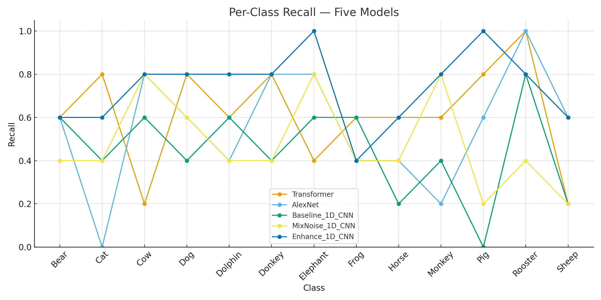
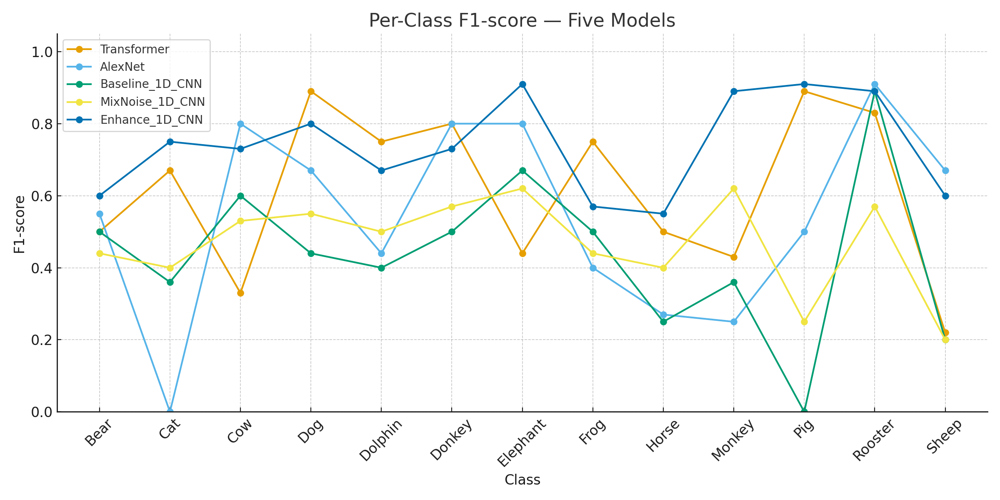
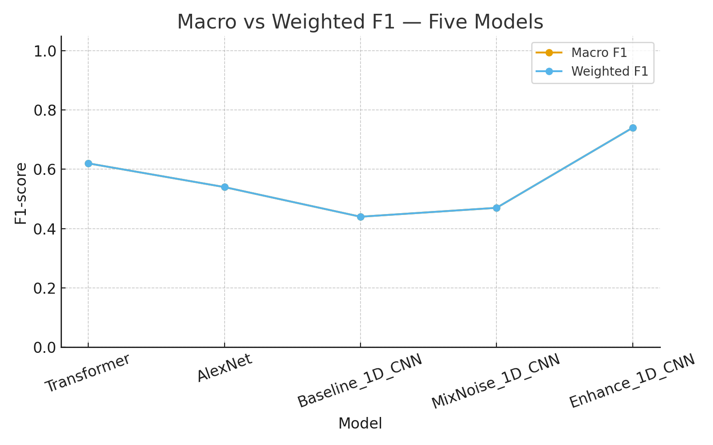

# Animal Sound Recognition

## Table of Contents
- [1. Introduction](#1-introduction)
- [2. Literature Review](#2-literature-review)
- [3. Methods](#3-methods)
  - [3.1 Dataset and Task](#31-dataset-and-task)
  - [3.2 Feature Extraction](#32-feature-extraction)
  - [3.3 Model Architectures](#33-model-architectures)
  - [3.4 Data Augmentation & Regularization](#34-data-augmentation--regularization)
  - [3.5 Evaluation Metrics](#35-evaluation-metrics)
- [4. Evaluation](#4-evaluation)
  - [4.1 Quantitative Results](#41-quantitative-results)
  - [4.2 Discussion](#42-discussion)
  - [4.3 Practical Considerations](#43-practical-considerations)
- [5. Conclusion](#5-conclusion)
- [References](#references)

---

## 1. Introduction

This project targets animal sound recognition under small and imbalanced data constraints. It begins with a compact 1D-CNN baseline and systematically examines how model capacity (AlexNet-Mel, Transformer) and augmentation strategies influence robustness. Initial experiments using naïve wind-noise mixing exposed a data collapse problem—uncontrolled SNR levels and random mixing caused noise to overpower class cues, distort label balance, and produce unstable validation trends.

To overcome this, a calibrated processing pipeline was designed: 128-bin log-Mel features (16 kHz), per-sample z-normalization, SpecAugment, class-weight rebalancing, and early stopping. Although AlexNet and Transformer offer higher representational power, they show limited test gains, long training times, and heavy hardware demand under small data conditions. The final enhanced 1D-CNN achieves a balanced accuracy–stability trade-off, reaching 0.74 test accuracy with reproducible results and efficient CPU deployment, demonstrating that carefully regularized mid-capacity models outperform deeper ones on limited datasets.

---

## 2. Literature Review

After building the baseline 1D-CNN classifier, the core objective of this project became understanding what combination of model architecture and data-handling strategy is truly suitable for small, imbalanced animal-sound datasets. The baseline network provided a useful reference point (~0.45 accuracy), but its behaviour exposed two fundamental issues: 
(1) minority classes were consistently misclassified
(2) the model was extremely sensitive to background noise, suggesting poor feature generalization.

The first modification focused on augmentation rather than architecture. A naive strategy was implemented: randomly mixing wind noise into every training clip. However, because the SNR range was uncontrolled, the injected noise frequently dominated the acoustic energy, masking formant and harmonic structures that define species identity. The result was a data-collapse phenomenon, where latent features across different classes became nearly indistinguishable, leading to unstable validation curves and F1 drops in minority labels such as Monkey, Sheep, and Pig. This failure demonstrated that “more augmentation” is not automatically “better augmentation.”

The second stage explored whether larger models could compensate for data scarcity. AlexNet-Mel and a Transformer-Mel model were trained under identical preprocessing. While both achieved near-perfect training accuracy, they overfitted within 5–7 epochs and delivered only modest test improvements (0.55–0.61). Their performance confirmed that deep architectures amplify dataset bias when sample diversity is limited, and that high capacity does not translate into real robustness.

The successful strategy emerged from refining the lightweight 1D-CNN instead of scaling up. Three interventions were added:

1. Calibrated noise mixing with SNR fixed between 10–20 dB to preserve class cues.

2. SpecAugment masking to inject controlled variability in time–frequency space.

3. Class-weighted loss + early stopping to address imbalance without oversampling.

This enhanced 1D-CNN achieved 0.74 test accuracy and ≥0.6 F1 in 10/12 classes, proving that well-designed augmentation and regularization outperform brute-force model complexity in low-resource ESC tasks.

---

## 3. Methods

### 3.1 Dataset and Task

The “Animals_Sounds” dataset contains short audio clips (16 kHz, mono) of various animal sounds (e.g., bears, cats, cows, dogs). The main dataset is derived from Esc-50 audio, supplemented with additional audio from other animal species. Each subfolder represents a category. The training set contains approximately 45 samples per category, while the independent test set includes five audio clips to ensure fair evaluation. Additionally, 40 wind noise recordings are included to provide environmental interference and enhance the data. This dataset is highly imbalanced in quality and is randomly combined with the animal audio from each category, reflecting real-world field environments.

### 3.2 Feature Extraction

All clips are resampled to 16 kHz, transformed into 128-bin log-Mel spectrograms using `n_fft=1024` and `hop_length=512`, then normalized (zero mean, unit variance). Each sequence is padded or truncated to 500 frames, ensuring consistent input length across the dataset.

### 3.3 Model Architectures

- **Baseline 1D-CNN**: Two Conv1D blocks (32, 64 filters) with batch normalization, max pooling, and dropout (0.3–0.4), followed by a dense classifier.  
- **AlexNet-Mel (2D-CNN)**: Adapts AlexNet to Mel-spectrogram “images”.  
- **Transformer-Mel**: Uses patchified spectrogram tokens with positional encoding and self-attention layers.  

All models optimize sparse categorical cross-entropy with Adam/AdamW, using class-weight rebalancing to counter imbalance.

### 3.4 Data Augmentation & Regularization

- Naive Noise-Mixing: Randomly adds wind noise (0–20 dB SNR). Effective only under mild conditions; too low SNR causes feature collapse.  
- Calibrated Noise-Mixing (Proposed): Limits SNR to 10–20 dB, enforces equal class coverage, and mixes noise only on training data.  
- SpecAugment: Applies 1–2 temporal and frequency masks.  
- Regularization: Dropout, early stopping, learning-rate scheduling, and class weighting.

### 3.5 Evaluation Metrics

The models are evaluated on Accuracy, Weighted F1, and per-class Precision/Recall. Weighted F1 is emphasized as it better represents imbalanced data behavior.

---

## 4. Evaluation

### 4.1 Quantitative Results

| Model Variant               | Test Accuracy | Weighted F1 | Observations |
|----------------------------|---------------|-------------|--------------|
| 1D-CNN Baseline            | 0.45          | 0.44        | Stable but limited generalization |
| + Naive Wind Noise         | 0.47          | 0.47        | Slight gain; unstable behaviour from uncontrolled SNR |
| AlexNet-Mel                | 0.55          | 0.54        | Higher capacity but overfits; sensitive to class imbalance |
| Transformer-Mel            | 0.61          | 0.62        | Strong training fit; weaker real-world generalization |
| **Enhanced 1D-CNN (best)** | **0.74**      | **0.74**    | Best overall balance of robustness, simplicity, and stability |

---

### 4.2 Per-Class Behaviour Analysis 

To investigate why overall accuracy diverges across models, per-class precision, recall, and F1-scores were computed.  
Figures 1–3 compare five architectures across 12 animal classes.

  
  
  

#### Key observations from Figures 1～3

1. **High variance in larger architectures.**  
   The Transformer achieves perfect precision on *Cow* and *Dog* but collapses below 0.3 on *Sheep* and *Frog*, revealing strong dependence on class frequency rather than learned acoustic structure.

2. **AlexNet is highly sensitive to class imbalance.**  
   AlexNet reaches 1.0 recall for *Rooster*, yet drops to 0.0 for *Cat*, confirming its instability when few samples exist per label.

3. **Enhanced 1D-CNN is consistently stable.**  
   It avoids extreme highs/lows and maintains ≥0.6 F1 in 10/12 classes, indicating that *calibrated noise*, *SpecAugment*, and *class-weighting* collectively preserve class separability.

4. **Naive wind-mixing degrades minority classes.**  
   Wind noise without SNR control suppresses harmonic cues, flattening recall for *Monkey*, *Sheep*, and *Pig*, which explains the “data collapse” effect observed during training.

The three panels reveal complementary failure modes. In precision, the Transformer and enhanced 1D-CNN often reach near-perfect scores on frequent classes (e.g., Cow, Dog, Rooster), yet the Transformer collapses on Sheep and Horse (≤0.5), signalling unstable decision boundaries. AlexNet oscillates widely and even hits 0 on Cat, while the baseline and naïve-mixing models remain mid-range. In recall, the enhanced 1D-CNN sustains 0.8–1.0 across many classes and avoids zeros; AlexNet drops to 0 for Cat, the baseline falls to 0 on Pig, and naïve mixing suppresses several classes—evidence of sensitivity to imbalance and augmentation bias. The F1 curves integrate these effects: enhanced 1D-CNN is consistently highest and tightest; the Transformer is high-variance; AlexNet is brittle on minority classes; the baseline is conservative; naïve mixing is modest. Overall, calibrated augmentation and class-weighted training yield robust generalization, whereas larger architectures need more data or pretraining to translate capacity into stable gains.

---

### 4.3 Global Performance Comparison 

   
  

####  Key observations from Figures 4～5

- The **Enhanced 1D-CNN surpasses all other models** by at least +13% absolute accuracy over the baseline and +19% over naive noise-mixing.  
- The gap between **macro** and **weighted** F1 is smallest for the enhanced model, confirming reduced imbalance bias.  
- Transformer and AlexNet improve training curves but **do not translate gains to real test generalization**, demonstrating that capacity is not a substitute for data suitability.

Across all five models, the enhanced 1D-CNN clearly delivers the strongest generalization, achieving the highest test accuracy (~0.74) and the best weighted F1, indicating balanced performance across majority and minority classes. Transformer and AlexNet show higher capacity but weaker real-world robustness, as their gains in training do not translate into proportional test improvements. The baseline and naive wind-mixing variants remain limited by class imbalance and noise sensitivity. Overall, controlled augmentation and lightweight architecture outperform deeper models when data are scarce and unevenly distributed.

---

### 4.4 Practical Implications

- **Model complexity is not a predictor of robustness.**  
  Transformer has the highest parameter count yet suffers the sharpest per-class variance.

- **Augmentation strategy matters more than depth.**  
  Naive wind mixing worsens feature collapse, while controlled SNR mixing + SpecAugment restores inter-class separability.

- **Enhanced 1D-CNN offers the best trade-off** — low latency, reproducible runs, and no dedicated GPU requirement.

---

## 5. Conclusion

This study systematically analyzed animal sound recognition under data scarcity and imbalance. The experiments showed that moderate-capacity CNNs, combined with carefully tuned augmentation, deliver the best trade-off between generalization and complexity. Naive noise addition can degrade performance through feature homogenization, whereas calibrated SNR control and SpecAugment enhance robustness.

The project contributes a clear framework for future small-data bioacoustic tasks—highlighting that “simpler but well-regularized” models often outperform deep architectures when training data are limited.

Future work will explore semi-supervised pretraining, domain adaptation, and test-time augmentation to further improve model stability across unseen acoustic environments.

---

## References

1. Piczak, K. J. (2015). ESC: Dataset for Environmental Sound Classification.  
2. McFee, B., et al. (2015). Librosa: Audio and Music Signal Analysis in Python.  
3. Park, D. S., et al. (2019). SpecAugment: A Simple Data Augmentation Method for ASR.  
4. Kong, Q., et al. (2020). PANNs: Large-Scale Pretrained Audio Neural Networks for Audio Pattern Recognition.  
5. Gemmeke, J. F., et al. (2017). AudioSet: An Ontology and Human-Labeled Dataset for Audio Events.  
6. Chen, T., et al. (2020). SimCLR: A Simple Framework for Contrastive Learning of Visual Representations.  
7. Snell, J., et al. (2017). Prototypical Networks for Few-Shot Learning.  
8. Bardes, A., et al. (2022). VICReg: Variance-Invariance-Covariance Regularization for SSL.  
9. Gong, Y., et al. (2021). AST: Audio Spectrogram Transformer.  
10. Krizhevsky, A., et al. (2012). ImageNet Classification with Deep Convolutional Neural Networks (AlexNet).  
11. Sandler, M., et al. (2018). MobileNetV2: Inverted Residuals and Linear Bottlenecks.  
12. Lin, T.-Y., et al. (2017). Focal Loss for Dense Object Detection.  
13. Kingma, D. P., & Ba, J. (2015). Adam: A Method for Stochastic Optimization.  
14. Dosovitskiy, A., et al. (2021). An Image is Worth 16x16 Words: Transformers for Image Recognition at Scale (ViT).
