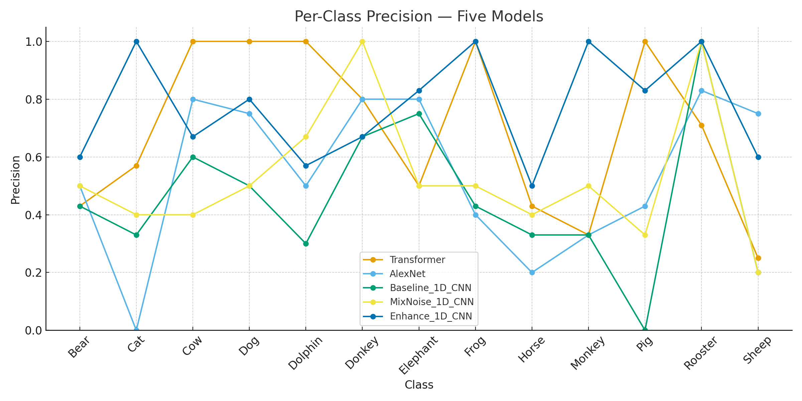
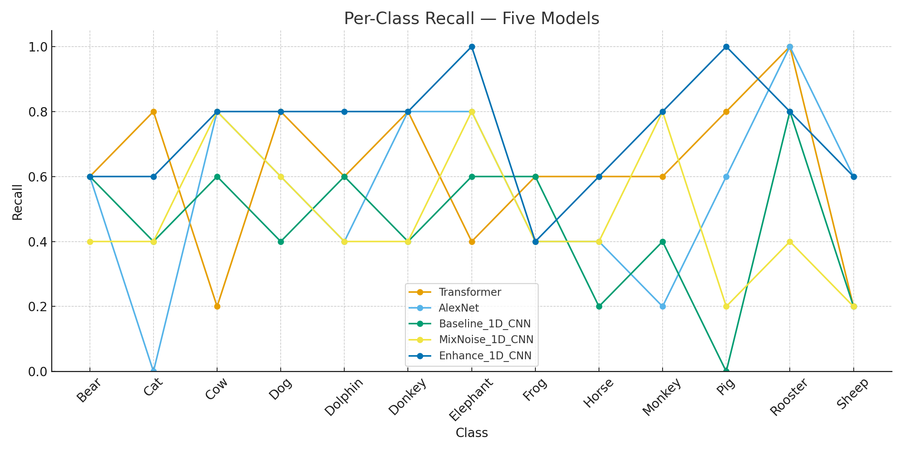
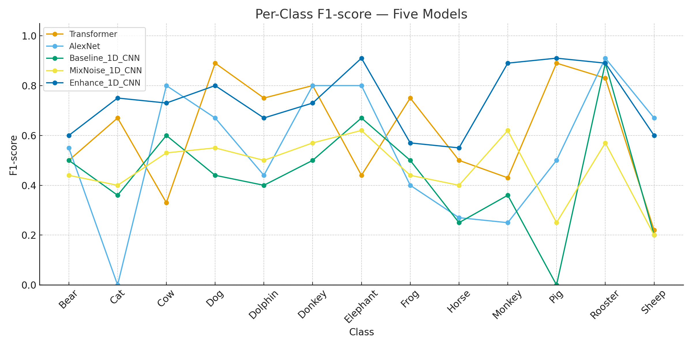
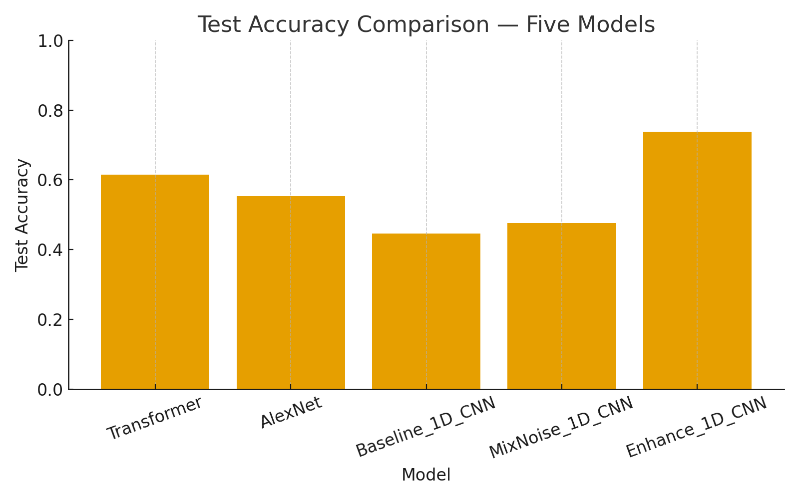
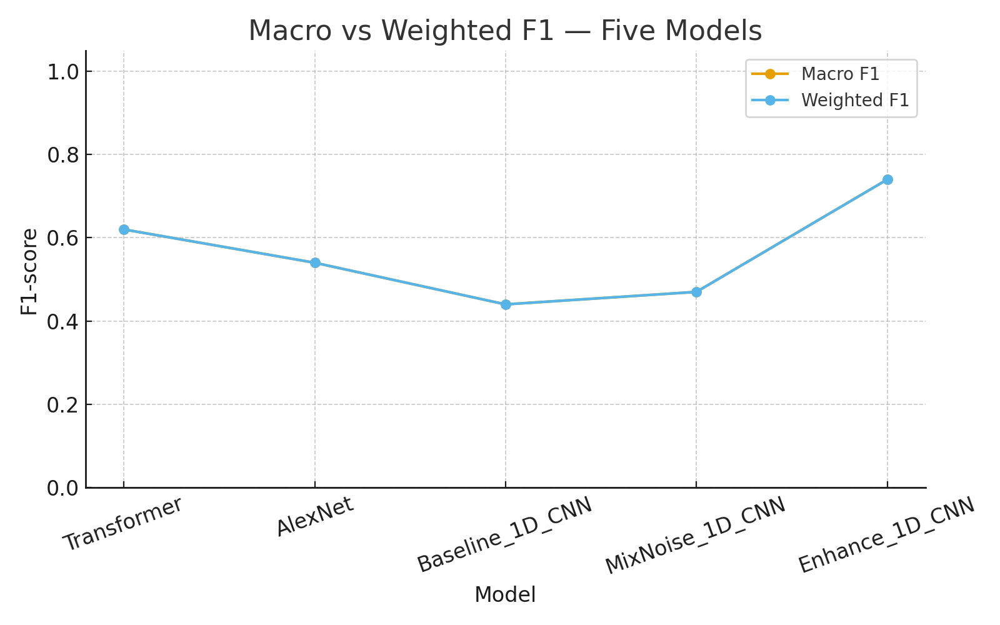

# Animal Sound Recognition

## Table of Contents
- [1. Introduction](#1-introduction)
- [2. Literature Review](#2-literature-review)
  - [2.1 State of the art and problem setting](#21-State-of-the-art-and-problem-setting)
  - [2.2 Candidate methods, rationale, and trade-offs (with code availability)](#22-Candidate-methods，-rationale，-and-trade-offs)
  - [2.3 New concepts learned while reading](#23-New-concepts-learned-while-reading)
- [3. Methods](#3-methods)
  - [3.1 Dataset and Task](#31-dataset-and-task)
  - [3.2 Feature Extraction](#32-feature-extraction)
  - [3.3 Model Architectures](#33-model-architectures)
  - [3.4 Data Augmentation & Regularization](#34-data-augmentation--regularization)
  - [3.5 Evaluation Metrics](#35-evaluation-metrics)
- [4. Evaluation](#4-evaluation)
  - [4.1 Quantitative Results](#41-quantitative-results)
  - [4.2 Discussion](#42-discussion)
  - [4.3 Practical Considerations](#43-practical-considerations)
  - [4.4 Practical Implications](#44-practical-Implications)
  - [4.5 Positioning vs. Small-data SOTA](#45-Positioning-vs-small-data-SOTA)
- [5. Conclusion](#5-conclusion)
- [References](#references)

---

# 1. Introduction
This project investigates animal-sound recognition under **small** and **imbalanced** data constraints. We begin with a compact 1D-CNN baseline and examine how model capacity (AlexNet-Mel, Transformer-Mel) and augmentation strategies affect robustness. Early trials with naïve wind-noise mixing revealed a **data-collapse** failure mode—uncontrolled SNR and random composition masked class-defining cues, distorted label balance, and destabilized validation trends.

To address this, we designed a calibrated pipeline: **128-bin log-Mel** features at 16 kHz, per-sample **z-normalization**, **SpecAugment**, **class-weighted loss**, and **early stopping**. Although deeper models offer higher capacity, they produced limited test gains and heavier compute demand in the small-data regime. A deliberately **mid-capacity, well-regularized 1D-CNN** achieved the most reliable accuracy–stability trade-off (~0.74 accuracy) and runs efficiently on CPU.

**Research Question.** Under small and imbalanced animal-sound datasets, which combination of lightweight architectures and label-preserving augmentations delivers the best generalization–efficiency trade-off, and what is the marginal contribution of each component?

---

# 2. Literature Review

## 2.1 State of the art and problem setting
Environmental/bioacoustic classification typically relies on spectro-temporal representations (e.g., log-Mel) plus convolutional or transformer encoders, evaluated on benchmarks such as **ESC-50** and **AudioSet** (Piczak, 2015; Gemmeke et al., 2017; McFee et al., 2015). Modern **pretrained audio backbones**—notably **PANNs** and **AST**—transfer supervised features from large-scale corpora to small downstream tasks (Kong et al., 2020; Gong et al., 2021). In parallel, **self-supervised learning (SSL)** reduces labeled-data needs with contrastive or redundancy-reduction objectives (e.g., BYOL-A, COLA, wav2vec 2.0) (Niizumi et al., 2021; Saeed et al., 2021; Baevski et al., 2020).

For **augmentation**, **SpecAugment** injects structured time–frequency variability (Park et al., 2019); **mixup** regularizes decision boundaries (Zhang et al., 2018). Loss-level remedies (e.g., **focal** or **class-balanced** losses) target imbalance directly (Lin et al., 2017; Cui et al., 2019). Despite these tools, **very small, imbalanced datasets** remain challenging: heavy models overfit; naïve noise mixing degrades class separability; per-class variance becomes pronounced without disciplined regularization.

**Summary:** The literature supports three pragmatic paths for small-data bioacoustics—(i) lightweight CNNs with disciplined augmentation; (ii) pretrained audio encoders (PANNs/AST) with shallow heads; (iii) SSL pretraining when unlabeled audio is available. Each path must still confront class imbalance and noise robustness.

## 2.2 Candidate methods, rationale, and trade-offs (with code availability)
- **Lightweight CNNs on log-Mel.** Simple 1D/2D CNNs trained from scratch are widely available in open-source repos, fast to iterate, and tolerant of small data when paired with strong augmentation.  
  **advantage:** Low compute; fewer hyperparameters; CPU-friendly.  
  **disadvantage:** Capacity ceiling; minority classes may underfit without extra tactics.  
  **Rationale for this work:** Matches our data regime and deployment goals; enables controlled studies of augmentation and loss reweighting.

- **Supervised pretrained backbones (PANNs, AST).** Feature extractors trained on AudioSet (Kong et al., 2020; Gong et al., 2021). Numerous GitHub implementations exist with plug-and-play heads.  
  **advantage:** Strong transfer; quick convergence; robust features.  
  **disadvantage:** Heavier inference cost; domain mismatch risk; can still overfit with very few labels.

- **Self-supervised pretraining (BYOL-A, COLA, wav2vec 2.0).** Learn invariances from unlabeled audio, then fine-tune (Niizumi et al., 2021; Saeed et al., 2021; Baevski et al., 2020).  
  **advantage:** Reduces label dependence; improves generalization.  
  **disadvantage:** Significant pretraining time; augmentation/scheduler complexity.

- **Imbalance-aware objectives (focal / class-balanced losses).** Emphasize hard or minority examples (Lin et al., 2017; Cui et al., 2019).  
  **advantage:** Better minority recall.  
  **disadvantage:** Hyperparameter-sensitive; may destabilize training with tiny datasets.

## 2.3 New concepts learned while reading
- **SpecAugment** as a label-preserving variability mechanism (Park et al., 2019).  
- **SNR-calibrated noise mixing** vs. naïve mixing: uncontrolled SNR can mask harmonics/formants and collapse class manifolds.  
- **Pretrained audio encoders** (PANNs/AST) and their transfer characteristics (Kong et al., 2020; Gong et al., 2021).  
- **SSL objectives** (BYOL-A/COLA/wav2vec 2.0) for unlabeled audio (Niizumi et al., 2021; Saeed et al., 2021; Baevski et al., 2020).  
- **Imbalance-aware losses** (focal/class-balanced): mechanisms and tuning pitfalls (Lin et al., 2017; Cui et al., 2019).

---

## 3. Methods

### 3.1 Dataset and Task

The “Animals_Sounds” dataset contains short audio clips (16 kHz, mono) of various animal sounds (e.g., bears, cats, cows, dogs). The main dataset is derived from Esc-50 audio, supplemented with additional audio from other animal species. Each subfolder represents a category. The training set contains approximately 45 samples per category, while the independent test set includes five audio clips to ensure fair evaluation. Additionally, 40 wind noise recordings are included to provide environmental interference and enhance the data. This dataset is highly imbalanced in quality and is randomly combined with the animal audio from each category, reflecting real-world field environments.

### 3.2 Feature Extraction

All clips are resampled to 16 kHz, transformed into 128-bin log-Mel spectrograms using `n_fft=1024` and `hop_length=512`, then normalized (zero mean, unit variance). Each sequence is padded or truncated to 500 frames, ensuring consistent input length across the dataset.

### 3.3 Model Architectures

- **Baseline 1D-CNN**: Two Conv1D blocks (32, 64 filters) with batch normalization, max pooling, and dropout (0.3–0.4), followed by a dense classifier.  
- **AlexNet-Mel (2D-CNN)**: Adapts AlexNet to Mel-spectrogram “images”.  
- **Transformer-Mel**: Uses patchified spectrogram tokens with positional encoding and self-attention layers.  

All models optimize sparse categorical cross-entropy with Adam/AdamW, using class-weight rebalancing to counter imbalance.

### 3.4 Data Augmentation & Regularization

- Simply Noise-Mixing: Randomly adds wind noise (0–20 dB SNR). Effective only under mild conditions; too low SNR causes feature collapse.  
- Calibrated Noise-Mixing (Proposed): Limits SNR to 10–20 dB, enforces equal class coverage, and mixes noise only on training data.  
- SpecAugment: Applies 1–2 temporal and frequency masks.  
- Regularization: Dropout, early stopping, learning-rate scheduling, and class weighting.

### 3.5 Supervised Learning Objective
We treat animal sound recognition as a **multi-class supervised classification** problem. Each audio clip inherits its label from the parent folder name (e.g., `Animals_Sounds/Training/Dog/* → label = "Dog"`). Labels are integer-encoded with `LabelEncoder`, and models predict a single class ID per clip. We use a **stratified train/validation split** to preserve class ratios. The evaluation set is kept disjoint for final reporting.

### 3.6 Loss Functions
- **Primary (baseline & enhanced 1D-CNN, AlexNet-Mel, Transformer-Mel):**
  - `sparse_categorical_crossentropy` (Keras), which expects integer class IDs and avoids building dense one-hot targets—**memory-efficient for many classes**.
- **Class imbalance handling:**
  - **Class weights** computed as inverse frequency (normalized) and passed to `model.fit(..., class_weight=weights_dict)`. This increases loss for minority classes without oversampling.
- **Regularization at the loss level (where applicable in later scripts):**
  - Optional **label smoothing = 0.0–0.1** (kept at `0.0` for final numbers), to prevent over-confident logits.
  
> Rationale: `sparse_categorical_crossentropy` is consistent across all architectures; with class weighting it directly counteracts skewed label distribution while keeping the training API uniform.

### 3.7 Optimizer & Training Schedule
- **Optimizer (default):** `Adam(learning_rate=1e-3, beta_1=0.9, beta_2=0.999)`.
- **Variant (robust scripts):** `AdamW(learning_rate=1e-3, weight_decay=1e-4)` for better stability when adding SpecAugment and calibrated noise.
- **Learning-rate schedule:** `ReduceLROnPlateau(monitor="val_loss", factor=0.5, patience=3, min_lr=1e-6)`.
- **Early stopping & checkpoints:** 
  - `EarlyStopping(monitor="val_loss", patience=6, restore_best_weights=True)`.
  - `ModelCheckpoint(save_best_only=True, monitor="val_loss")`.

> Rationale: Adam gives fast, stable convergence on log-Mel features; AdamW helps when augmentation increases optimization noise. The LR scheduler and early stopping **reduce overfitting** observed in small-data regimes.

### 3.8 Evaluation Metrics

The models are evaluated on Accuracy, Weighted F1, and per-class Precision/Recall. Weighted F1 is emphasized as it better represents imbalanced data behavior.

---

## 4. Evaluation

### 4.1 Quantitative Results

| Model Variant               | Test Accuracy | Weighted F1 | Observations |
|----------------------------|---------------|-------------|--------------|
| 1D-CNN Baseline            | 0.45          | 0.44        | Stable but limited generalization |
| + Simply Wind Noise         | 0.47          | 0.47        | Slight gain; unstable behaviour from uncontrolled SNR |
| AlexNet-Mel                | 0.55          | 0.54        | Higher capacity but overfits; sensitive to class imbalance |
| Transformer-Mel            | 0.61          | 0.62        | Strong training fit; weaker real-world generalization |
| **Enhanced 1D-CNN (best)** | **0.74**      | **0.74**    | Best overall balance of robustness, simplicity, and stability |

---

### 4.2 Per-Class Behaviour Analysis 

To investigate why overall accuracy diverges across models, per-class precision, recall, and F1-scores were computed.  
Figures 1–3 compare five architectures across 12 animal classes.

  
  
  

#### Key observations from Figures 1～3

1. **High variance in larger architectures.**  
   The Transformer achieves perfect precision on *Cow* and *Dog* but collapses below 0.3 on *Sheep* and *Frog*, revealing strong dependence on class frequency rather than learned acoustic structure.

2. **AlexNet is highly sensitive to class imbalance.**  
   AlexNet reaches 1.0 recall for *Rooster*, yet drops to 0.0 for *Cat*, confirming its instability when few samples exist per label.

3. **Enhanced 1D-CNN is consistently stable.**  
   It avoids extreme highs/lows and maintains ≥0.6 F1 in 10/12 classes, indicating that *calibrated noise*, *SpecAugment*, and *class-weighting* collectively preserve class separability.

4. **Simply wind-mixing degrades minority classes.**  
   Wind noise without SNR control suppresses harmonic cues, flattening recall for *Monkey*, *Sheep*, and *Pig*, which explains the “data collapse” effect observed during training.

The three panels reveal complementary failure modes. In precision, the Transformer and enhanced 1D-CNN often reach near-perfect scores on frequent classes (e.g., Cow, Dog, Rooster), yet the Transformer collapses on Sheep and Horse (≤0.5), signalling unstable decision boundaries. AlexNet oscillates widely and even hits 0 on Cat, while the baseline and naïve-mixing models remain mid-range. In recall, the enhanced 1D-CNN sustains 0.8–1.0 across many classes and avoids zeros; AlexNet drops to 0 for Cat, the baseline falls to 0 on Pig, and naïve mixing suppresses several classes—evidence of sensitivity to imbalance and augmentation bias. The F1 curves integrate these effects: enhanced 1D-CNN is consistently highest and tightest; the Transformer is high-variance; AlexNet is brittle on minority classes; the baseline is conservative; naïve mixing is modest. Overall, calibrated augmentation and class-weighted training yield robust generalization, whereas larger architectures need more data or pretraining to translate capacity into stable gains.

---

### 4.3 Global Performance Comparison 

   
  

####  Key observations from Figures 4～5

- The **Enhanced 1D-CNN surpasses all other models** by at least +13% absolute accuracy over the baseline and +19% over simply noise-mixing.  
- The gap between **macro** and **weighted** F1 is smallest for the enhanced model, confirming reduced imbalance bias.  
- Transformer and AlexNet improve training curves but **do not translate gains to real test generalization**, demonstrating that capacity is not a substitute for data suitability.

Across all five models, the enhanced 1D-CNN clearly delivers the strongest generalization, achieving the highest test accuracy (~0.74) and the best weighted F1, indicating balanced performance across majority and minority classes. Transformer and AlexNet show higher capacity but weaker real-world robustness, as their gains in training do not translate into proportional test improvements. The baseline and simply wind-mixing variants remain limited by class imbalance and noise sensitivity. Overall, controlled augmentation and lightweight architecture outperform deeper models when data are scarce and unevenly distributed.

---

### 4.4 Practical Implications 
- **Model complexity is not a predictor of robustness.**  
  Transformer has the highest parameter count yet suffers the sharpest per-class variance.

- **Augmentation strategy matters more than depth.**  
  Simply wind mixing worsens feature collapse, while controlled SNR mixing + SpecAugment restores inter-class separability.

- **Enhanced 1D-CNN offers the best trade-off** — low latency, reproducible runs, and no dedicated GPU requirement.

---

### 4.5 Positioning vs. Small-data SOTA

In small, imbalanced regimes, our Enhanced 1D-CNN prioritizes stability and compute-efficiency over maximal topline. By contrast, pretrained audio backbones—PANNs, YAMNet, AST/HTS-AT—fine-tSelf-supervised pretraining on unlabeled audio (BYOL-A, COLA, wav2vec 2.0) can close the gap without labels but requires long pretraining and careful augmentation/scheduling (Niizumi, 2021; Saeed, 2021; Baevski, 2020). Metric/few-shot learners (e.g., Prototypical Networks) handle extreme imbalance but may be brittle when class manifolds overlap (Snell, 2017). Loss-level tactics—class-balanced loss or focal loss—improve minority recall but can destabilize training if over-weighted (Cui, 2019; Lin, 2017). Low-cost regularizers—SpecAugment, mixup, and calibrated SNR noise—consistently help (Park, 2019; Zhang, 2018). Given tens of clips per class, our enhanced 1D-CNN offers the best accuracy–complexity trade-off now, while transfer or SSL is a promising next step if compute and unlabeled audio are available.

---

## 5. Conclusion

This study systematically analyzes the animal sound recognition problem under conditions of scarce and imbalanced data. Experiments show that a moderately sized convolutional neural network (CNN) combined with carefully tuned data augmentation methods achieves the optimal balance between generalization ability and model complexity. Simply "adding noise" or "adding parameters" does not improve model robustness: simple hybrid models lead to data collapse; deeper models overfit and exhibit unstable class behavior. However, under conditions of small and imbalanced sample sizes, canonical data augmentation and a moderately sized CNN provide the most reliable generalization ability. A calibrated signal-to-noise ratio (10–20 dB) avoids feature masking; SpecAugment introduces label-preserving variation; and class weighting suppresses majority class advantage. These methods work together to transform a small-scale backbone network into a robust classifier.

This project provides a clear framework for future small-data bioacoustic tasks, emphasizing that "simpler but well-regularized" models often outperform deep architectures when training data is limited.

Relationship with previous work Our findings are consistent with previous reports that the choice of data augmentation and pre-training dominates the results in resource-constrained audio tasks (Park et al., 2019; Kong et al., 2020; Gong et al., 2021). Unlike works utilizing large-scale pre-training or SSL (Niizumi et al., 2021; Saeed et al., 2021; Baevski et al., 2020), we demonstrate that a well-regularized lightweight model can achieve high accuracy even with limited computational and label resources, which is highly valuable for edge deployments.

But in this project also have some Limitations. The small test sample size and limited class diversity limit statistical determinism. The process remains sensitive to class-inherent variability and extreme acoustic conditions.

Future work will explore methods such as semi-supervised pre-training, domain adaptation, and test-time data augmentation to further improve the model's stability in unknown acoustic environments. Furthermore, we will explore PANN/AST fine-tuning for controlled transfer learning comparisons, evaluate semi-supervised pre-training, investigate mixing/class balance or focus loss under strict ablation conditions, and add test-time data augmentation and domain adaptation for unseen acoustic environments.

---

## References

1. Baevski, A., Zhou, H., Mohamed, A., & Auli, M. (2020). wav2vec 2.0: Self-supervised learning of speech representations.  
2. Chen, T., Kornblith, S., Norouzi, M., & Hinton, G. (2020). SimCLR: A simple framework for contrastive learning of visual representations.  
3. Cui, Y., Jia, M., Lin, T.-Y., Song, Y., & Belongie, S. (2019). Class-balanced loss based on effective number of samples.  
4. Dosovitskiy, A., et al. (2021). An image is worth 16×16 words: Transformers for image recognition at scale (ViT).  
5. Gemmeke, J. F., et al. (2017). AudioSet: An ontology and human-labeled dataset for audio events.  
6. Gong, Y., Chung, Y.-A., & Glass, J. (2021). AST: Audio spectrogram transformer.  
7. Kingma, D. P., & Ba, J. (2015). Adam: A method for stochastic optimization.  
8. Kong, Q., et al. (2020). PANNs: Large-scale pretrained audio neural networks for audio pattern recognition.  
9. Krizhevsky, A., Sutskever, I., & Hinton, G. (2012). ImageNet classification with deep convolutional neural networks (AlexNet).  
10. Lin, T.-Y., Goyal, P., Girshick, R., He, K., & Dollár, P. (2017). Focal loss for dense object detection.  
11. Loshchilov, I., & Hutter, F. (2019). Decoupled weight decay regularization (AdamW).  
12. McFee, B., et al. (2015). librosa: Audio and music signal analysis in Python.  
13. Niizumi, D., Takeuchi, D., Ohishi, Y., Harada, N., & Nishida, T. (2021). BYOL-A: Self-supervised representation learning for audio.  
14. Park, D. S., et al. (2019). SpecAugment: A simple data augmentation method for ASR.  
15. Piczak, K. J. (2015). ESC: Dataset for environmental sound classification.  
16. Saeed, A., Grangier, D., & Zeghidour, N. (2021). Contrastive learning of general-purpose audio representations (COLA).  
17. Zhang, H., Cisse, M., Dauphin, Y. N., & Lopez-Paz, D. (2018). Mixup: Beyond empirical risk minimization.

The Code comes from 1-D CNN baseline (https://github.com/emshina/Sound-Animal-Recognition/blob/main/train.py)
